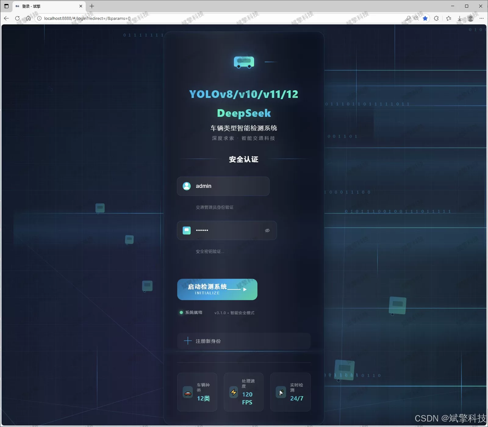
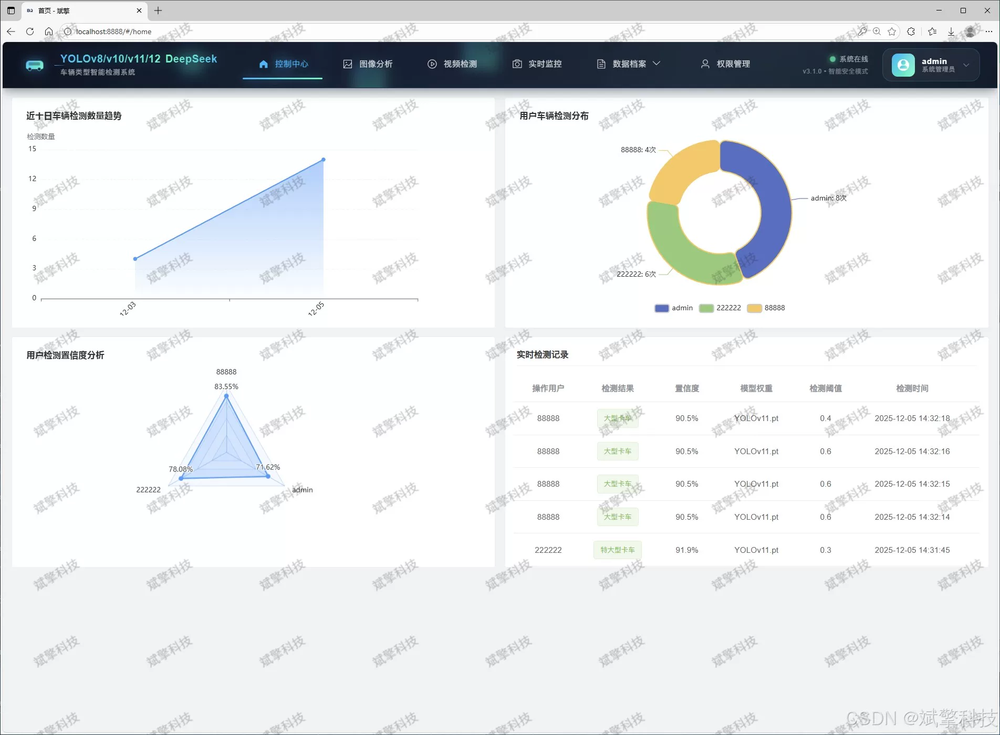
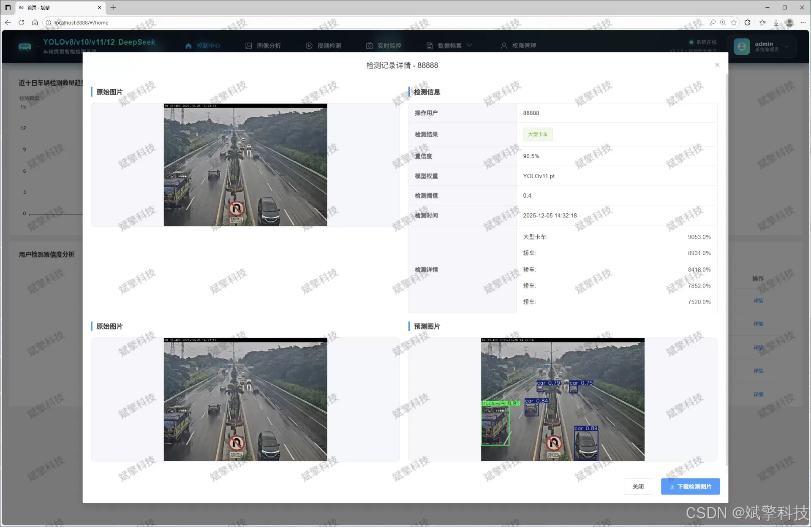
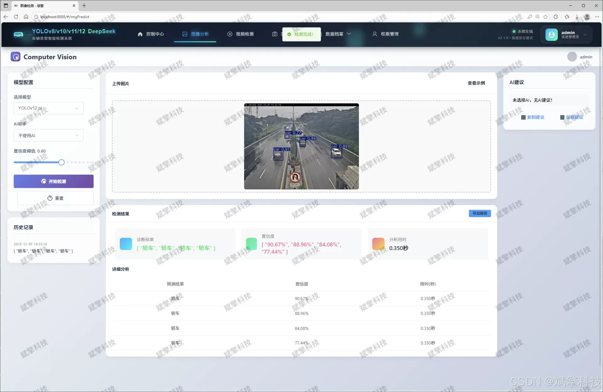
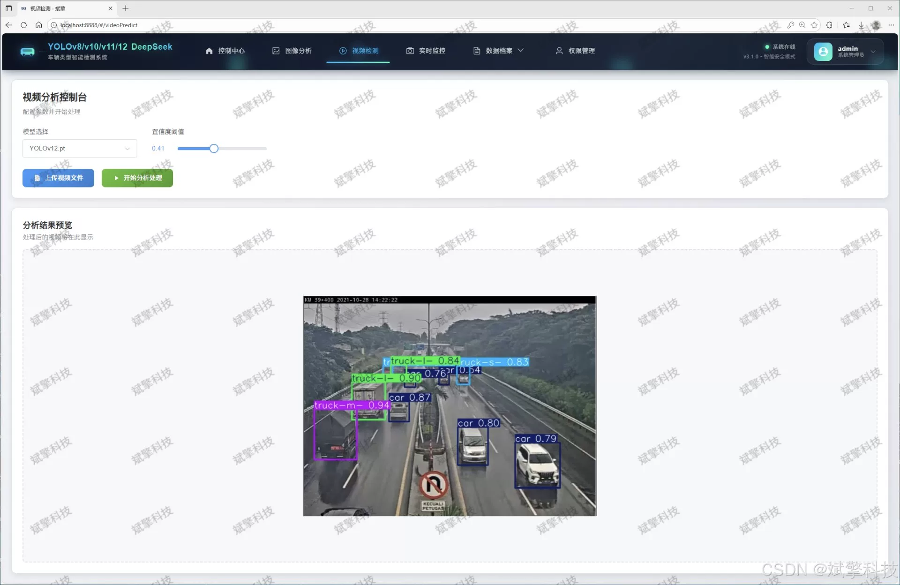
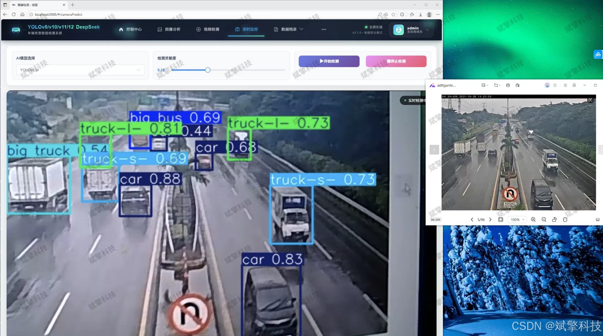
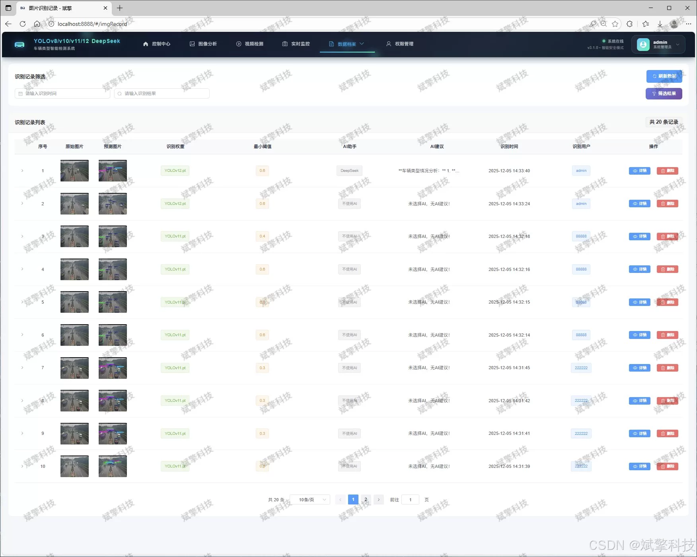
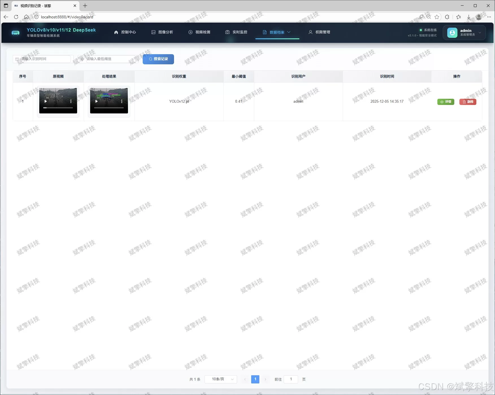
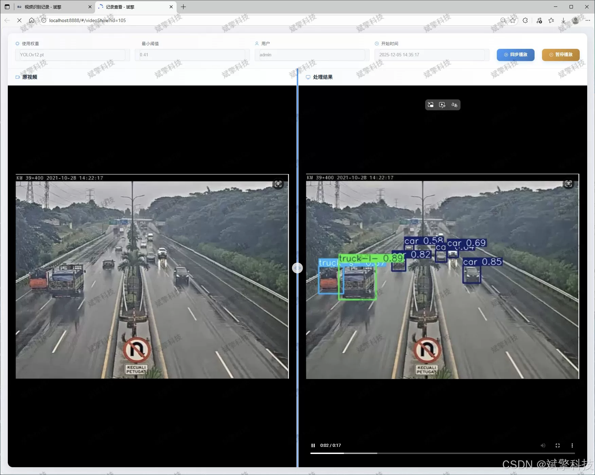

# Vehicle type classification based on YOLO deep learning and the large models of Qianwen and DeepSeek

## Body

Based on YOLO deep learning and the large models of Qianwen, DeepSeek intelligent vehicle type recognition detection system (DeepSeek intelligent analysis + web interface + front-end separation + YOLO data + YOLOv8/YOLOv10/YOLOv11/YOLOv12)

This article elaborates on the design and implementation of an intelligent vehicle type recognition detection system that integrates advanced deep learning object detection algorithms with a modern web interface. The system is centered around multiple versions of the YOLO series model (including the latest YOLOv8, YOLOv10, YOLOv11, YOLOv12), constructing a comprehensive web application platform with a front-end separation. The system not only achieves precise vehicle detection and 12-class fine vehicle classification from images, videos, and real-time camera streams but also innovatively integrates AI intelligent analysis functions from the DeepSeek large language model, providing semantic descriptions and in-depth insights for the detection results. The backend uses a robust MySQL database to manage user information, detection records, and model metadata uniformly, offering a complete user permission system and data visualization dashboard. Experiments show that the system performs excellently on a dataset built from 12 vehicle classes and over 4000 images, featuring high accuracy, real-time performance, and good user interaction experience. It can be widely applied in scenarios such as smart transportation, security monitoring, vehicle surveys, and intelligent parking management.

Functional modules

✅ Information visualization, data visualization.

✅ Image detection supports AI analysis functions, including DeepSeek and Qianwen.

✅ Supports image detection, video detection, and real-time camera detection, with detection results saved to a MySQL database.

✅ Image recognition record management, video recognition record management, and camera recognition record management.

✅ User management module, allowing administrators to add, delete, update, and view users.

✅ Personal center, where users can modify their information, including passwords, names, profiles, etc.

## Images

## Payment

Here is a pay link on Stripe ( https://buy.stripe.com/3cs8yP7sY87d0vu9AB ). Please contact me lonlonago@foxmail.com after funding $89, and I will send you a complete data files , thank you!

